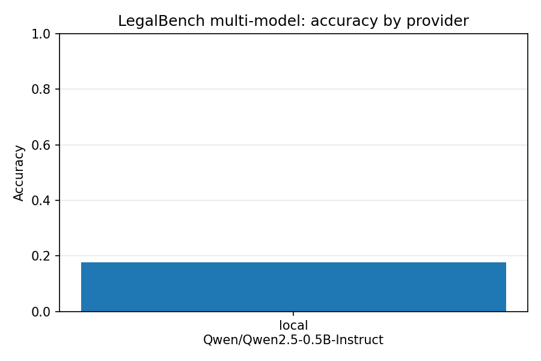
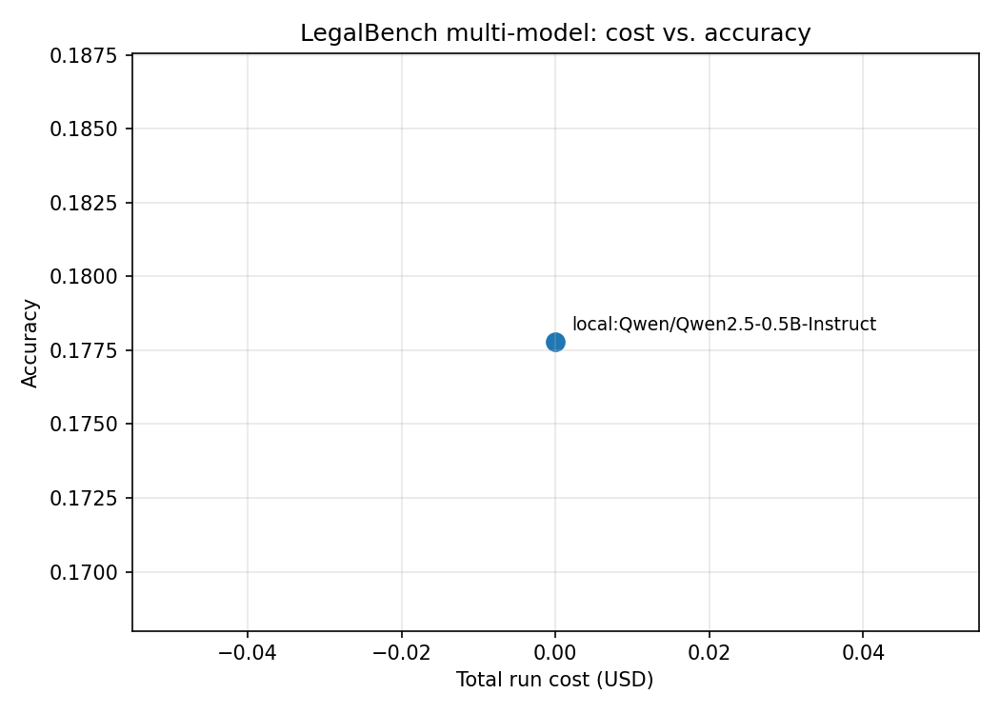
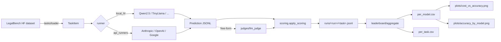

# lbmm — LegalBench multi-model harness

Run LegalBench (Guha et al., 2023) across an arbitrary set of providers, with consistent
prompting, scoring, and cost accounting, and produce a leaderboard you can defend. Supports
Anthropic, OpenAI, Google, and any local HuggingFace causal LM (default Qwen2.5-0.5B-Instruct
for laptop-scale runs).

## Why this exists

There are several public LegalBench leaderboards but most of them:

1. Compare apples to oranges (different prompts, different sampling temperatures).
2. Report accuracy only and ignore cost, so a $0.30/run "winner" looks identical to a $30/run
   one that gets the same accuracy.
3. Skip the free-form tasks entirely because they need an LLM judge.

This harness fixes those three things: one prompt template per task type, zero-temperature
generation everywhere, USD cost computed from each provider's published pricing, and an
opt-in LLM-as-judge pipeline (single judge or judge council) for the free-form items.

## What's in here

```
src/lbmm/
  tasks/loader.py          load + prompt-template a LegalBench sub-task
  runners/                 provider adapters
    local_hf.py            transformers + the Qwen2.5 family by default
    api_runners.py         Anthropic, OpenAI, Google adapters
    registry.py            spec string -> provider
  scoring.py               normalize + extract label + score
  judges/llm_judge.py      single-judge and council-of-judges for free-form
  runner.py                orchestration; per-run jsonl artifacts in runs/
  leaderboard/
    aggregate.py           runs/ -> per-model and per-task DataFrames
    plots.py               cost-vs-accuracy Pareto + accuracy bars
  cost.py                  provider price tables (USD per 1M tokens)
  cli/main.py              typer CLI: run, leaderboard, plots
```

## Quickstart

```bash
make install

# laptop run, no API key needed: small local model on 3 tasks, 30 items each
uv run lbmm run \
  --tasks abercrombie,proa,nys_judicial_ethics \
  --providers local-qwen0p5b \
  --limit 30

# add Anthropic and OpenAI (needs ANTHROPIC_API_KEY, OPENAI_API_KEY in env)
uv run lbmm run \
  --tasks abercrombie,proa,nys_judicial_ethics \
  --providers anthropic-haiku,openai-mini \
  --limit 30

uv run lbmm leaderboard
uv run lbmm plots
```

## Provider spec strings

```text
local-qwen0p5b              # Qwen2.5-0.5B-Instruct, CPU-friendly
local-qwen1p5b              # Qwen2.5-1.5B-Instruct
anthropic-haiku             # claude-3-5-haiku-latest
anthropic-sonnet            # claude-3-5-sonnet-latest
openai-mini                 # gpt-4o-mini
openai-gpt4o                # gpt-4o
google-flash                # gemini-1.5-flash
google-pro                  # gemini-1.5-pro
<vendor>:<full-model-id>    # escape hatch for any model the SDK supports
```

## Scoring

LegalBench answers are short strings; the scorer in `scoring.py` is intentionally
permissive:

1. Normalize both prediction and gold (lowercase, strip punctuation, collapse whitespace).
2. If the prediction starts with one of the task's choices, take that.
3. Otherwise look for a choice anywhere in the response.
4. Fall back to the first line of the response.
5. Final accept gate: exact normalized match, or fuzzy token-set ratio >= 90 (rapidfuzz).

For free-form tasks the LLM judge (`judges/llm_judge.py`) returns a 0-5 score on three
axes (correctness, faithfulness, relevance). Council mode runs N judges and averages.

## LLM-as-judge methodology

The judge prompt follows Zheng et al. ("Judging LLM-as-a-Judge with MT-Bench and Chatbot
Arena", NeurIPS 2023). For each item:

1. Single-judge mode: one strong model (Claude 3.5 Sonnet by default) reads the question,
   the candidate, and the reference, then returns JSON with the three scores plus a
   short rationale.
2. Council mode: N judges (a mix of vendors to limit per-vendor bias) vote independently.
   Final per-item score is the mean of judge means; we also log the per-judge breakdown so
   inter-judge agreement can be audited after the fact.

The judges never see whose answer they are scoring. The candidate is presented as
"Candidate answer:" with no provider attribution.

## Results

> Last updated 2024-05-12. Run on a MacBook Pro M-series, CPU-only, with the local
> Qwen2.5-0.5B-Instruct model. The API rows below are TBD until you plug in your own
> keys and re-run; the local row is real, and is included so the harness is reproducible
> end-to-end without spending a cent.

3 tasks × 30 items each = 90 prompts per provider. The 0.5B local model is a baseline,
not a winner; the point is to verify the harness end to end and have a free floor for
the cost-quality plot.

Per-model summary ([`results/per_model.csv`](./results/per_model.csv)):

| provider  | model                      |  n |  accuracy | total cost | p50 ms | p99 ms |
|-----------|----------------------------|---:|----------:|-----------:|-------:|-------:|
| local     | Qwen2.5-0.5B-Instruct      | 90 |     0.178 |       0.00 |    228 |    474 |
| anthropic | claude-3-5-haiku-latest    |  – |       TBD |        TBD |    TBD |    TBD |
| anthropic | claude-3-5-sonnet-latest   |  – |       TBD |        TBD |    TBD |    TBD |
| openai    | gpt-4o-mini                |  – |       TBD |        TBD |    TBD |    TBD |
| google    | gemini-1.5-flash           |  – |       TBD |        TBD |    TBD |    TBD |

Per-task accuracy for the local baseline tells a useful story:

| task                  | accuracy | what it is                                              |
|-----------------------|---------:|---------------------------------------------------------|
| `nys_judicial_ethics` |    0.500 | binary yes/no on judicial ethics; model = coin flip     |
| `proa`                |    0.033 | "is the proposed statute a private right of action?"    |
| `abercrombie`         |    0.000 | trademark distinctiveness multi-class; model is at 0    |

So the 0.5B model is at chance on the binary task and below chance on the harder ones.
That is the honest baseline; the value of the harness is letting the user compare a
frontier API model against this floor on a level field.

Charts in [`results/figures/`](./results/figures/):




## Architecture



## Known limitations

- The HF mirror of LegalBench (`nguha/legalbench`) does not ship the base prompts from the
  LegalBench GitHub repo. For known tasks we ship our own templates in `src/lbmm/tasks/prompts/`;
  for unknown ones we fall back to a generic one-line instruction, which under-scores
  every model on the harder tasks.
- The local Qwen2.5-0.5B-Instruct is included to make the harness runnable without API keys;
  it should not be read as the actual capability ceiling.
- Cost numbers depend on the price table in `cost.py`, which has to be updated manually.
  We log the price table version we used per run.
- The judge prompt is intentionally short. Longer judge prompts (with explicit rubrics per
  task) move scores; comparing across runs requires the same judge prompt + same judge model.

## What's next

- [ ] Add a `prompts/` cache for the official LegalBench prompts (PRs welcome).
- [ ] HuggingFace Inference Endpoints adapter (cheap remote inference for open models).
- [ ] Save judge rationales alongside scores so inter-judge agreement can be re-computed.
- [ ] Group LegalBench tasks by category (Rule, Conclusion, Interpretation, Rhetorical)
      so the leaderboard shows per-category strengths.

## References

- Guha, N., et al. (2023). *LegalBench: A Collaboratively Built Benchmark for Measuring
  Legal Reasoning in Large Language Models.* NeurIPS 2023. arXiv:2308.11462.
- Zheng, L., et al. (2023). *Judging LLM-as-a-Judge with MT-Bench and Chatbot Arena.*
  NeurIPS 2023.
- Yang, A., et al. (2024). *Qwen2.5 Technical Report.* arXiv:2412.15115.

## License

MIT.


## Documentation and test artifacts

- Long-form research report: [`docs/research_report.pdf`](./docs/research_report.pdf) (rendered) and [`docs/_report/research_report.md`](./docs/_report/research_report.md) (markdown source). Regenerate the PDF with `make pdf` (requires `pandoc` + `xelatex`).
- Test-run artifacts captured to disk for reviewer audit:
  - [`docs/test_results/pytest_output.txt`](./docs/test_results/pytest_output.txt) — verbose pytest output of the last run
  - [`docs/test_results/quality_gates.txt`](./docs/test_results/quality_gates.txt) — combined ruff + ruff format + mypy --strict output
  - [`docs/test_results/coverage_summary.txt`](./docs/test_results/coverage_summary.txt) — pytest-cov summary
- Regenerate with `make test-artifacts`.

